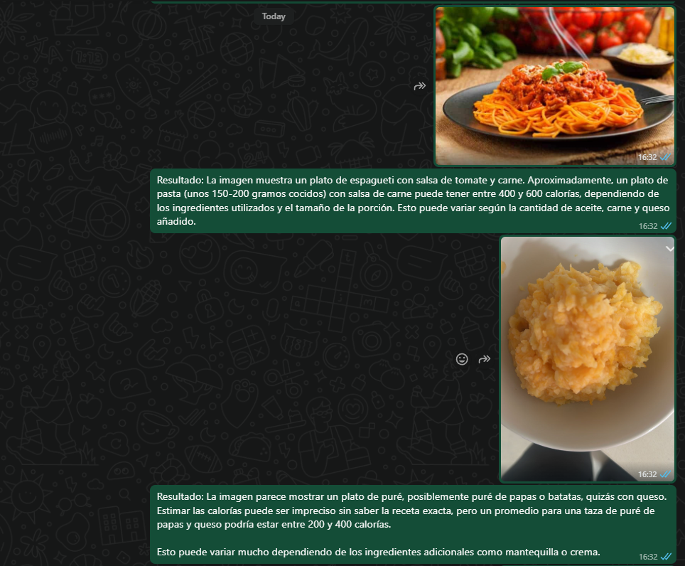
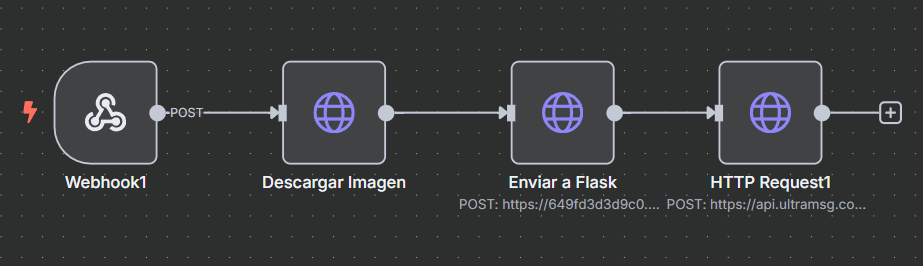

# 🥗 Estimador de Calorías con IA y WhatsApp

Este proyecto permite estimar las calorías de un plato de comida a partir de una imagen, utilizando la API de visión de OpenAI y un backend hecho en **FastAPI**. El resultado se envía automáticamente al usuario por **WhatsApp** a través de **UltraMsg** y **n8n**.

## 🚀 Tecnologías utilizadas

- [FastAPI](https://fastapi.tiangolo.com/) – Backend para recibir la imagen
- [OpenAI API](https://platform.openai.com/) – Modelo GPT-4o con visión para analizar la imagen
- [n8n](https://n8n.io/) – Automatización del flujo (descargar imagen, enviar a FastAPI, reenviar respuesta por WhatsApp)
- [UltraMsg](https://ultramsg.com/) – API para enviar mensajes de WhatsApp
- [ngrok](https://ngrok.com/) – Exposición temporal del servidor local para pruebas

## 🧠 Cómo funciona

1. El usuario o un sistema automático envía una imagen de un plato.
2. n8n descarga la imagen y la envía vía POST al endpoint `/estimacion` del servidor FastAPI.
3. FastAPI convierte la imagen a base64 y la envía al modelo de visión de OpenAI (GPT-4o).
4. OpenAI responde con una descripción del plato y una estimación de calorías.
5. n8n recibe la respuesta y la reenvía al usuario por WhatsApp usando UltraMsg.

##  Imágenes



## ⚙️ Instalación y uso

1. **Clonar el repositorio**

```bash
git clone https://github.com/tu_usuario/ckalAlimentos.git
cd ckalAlimentos

